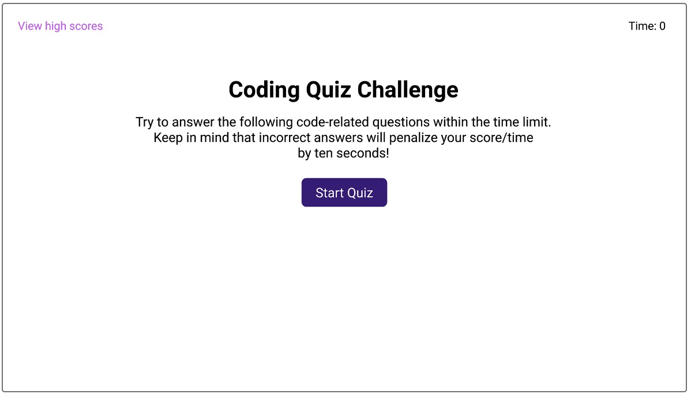
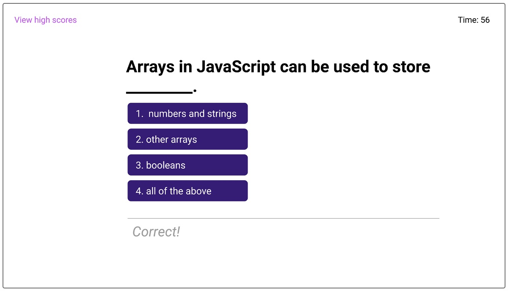
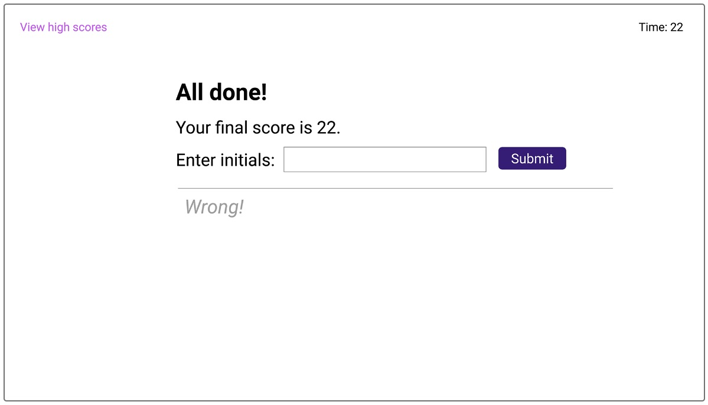
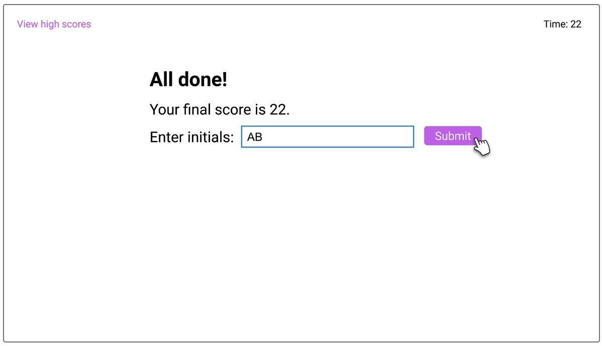
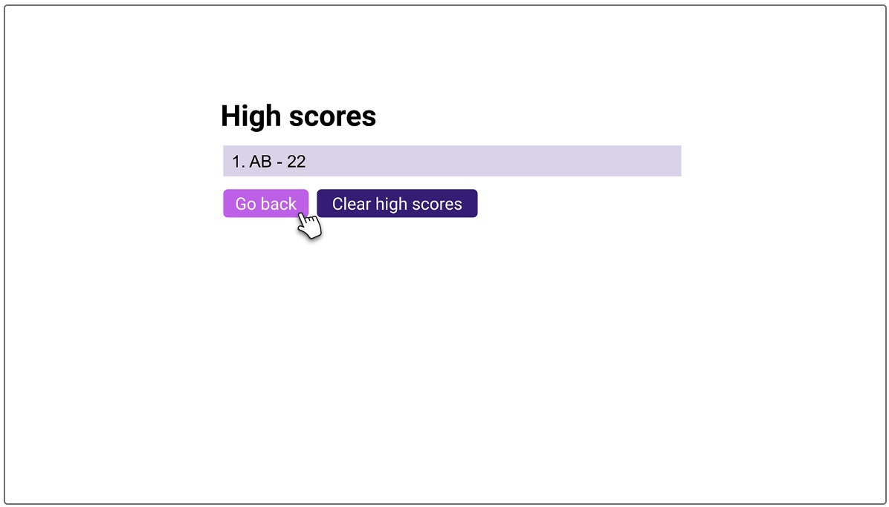

# code-quiz
The Coding Quiz is an interactive short quiz on beginner JavaScript with a timer as the score. 

## Description
This short quiz will:

    *Present the user with 5 questions with 4 answer choices.

    *Remove 10 seconds from the timer for each incorrect answer.

    *Take initials as input and store scores with initials in local storage.

    *Present the top 5 scores after the initials are entered.

    *Clear the top scores.

## User Story
AS A coding boot camp student

I WANT to take a timed quiz on JavaScript fundamentals that stores high scores

SO THAT I can gauge my progress compared to my peers

### Acceptance Criteria
GIVEN I am taking a code quiz

WHEN I click the start button

THEN a timer starts and I am presented with a question

WHEN I answer a question

THEN I am presented with another question

WHEN I answer a question incorrectly

THEN time is subtracted from the clock

WHEN all questions are answered or the timer reaches 0

THEN the game is over

WHEN the game is over

THEN I can save my initials and score

### Mock Up
Screenshot of the main page of code quiz.

Screenshot of a question display.

Screenshot of the all done display.

Screenshot of the all done with initials entered display.

Screenshot of the high scores display.

## Installation/Execution
https://vdunlop.github.io/code-quiz/

Starting the code quiz will present the user with the main screen and a button labeled Start Quiz. By clicking on Start Quiz, the timer will be set and started and the quiz questions will start displaying on the screen.

When a quiz answer is clicked, the answer will be validated and the next question will be displayed on the screen.

When the timer runs to 0, the quiz will be stopped, the timer/score will be set to 0 and the user will be prompted to enter their initials for score storage.

When the quiz is complete, without the timer running out, the score will be set to the current timer. The timer will be stopped and the user will be prompted to enter their initials for score storage.

When the user enters their initials into the form, the user's initials and score will be added to local storage. Then the high scores display will show the top 5 scores with initials.

## Usage
When you open the code quiz, you will be able to click on the "Start Quiz" button to start taking the beginner JavaScript quiz. As you answer the questions, you will see an indication of whether your choice was Correct or Incorrect. Each incorrect answer will deduct 10 seconds off of the timer. The final timer setting will be your score. When the quiz is complete, you will be asked to enter your initials. Your initials and score will be stored in local storage so that previous scores can be seen in a list of the top 5 scores.

There will be a countdown timer displayed in the upper left corner for your information.

## Credits

N/A

## License

N/A
